# OpenCore for intel nuc8i5ben

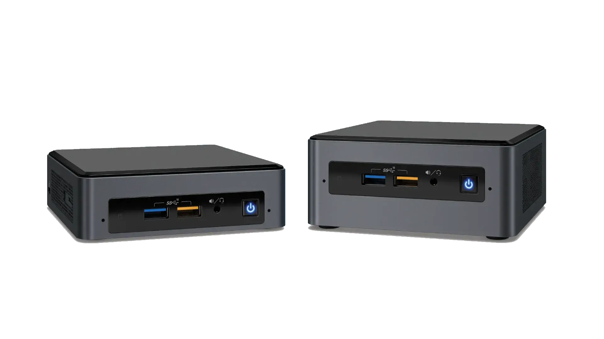

## 简介

比较完美😀。

|       Key        |         Value          |
| :--------------: | :--------------------: |
| OpenCore version |         0.8.9          |
|  MacOS version   | Ventura 13.2.1 (22D68) |

## Bios 设置

**禁用清单**

- Fast Boot - 快速启动
- VT-d (can be enabled if you set DisableIoMapper to YES) - VT-d（如果DisableIOMapper Quicks设置为YES，则可以启用）
- CSM - CSM 兼容性支持模块
- Thunderbolt - 雷雳
- Intel SGX - 英特尔SGX
- Intel Platform Trust- 英特尔平台信任
- CFG Lock (MSR 0xE2 write protection) - CFG锁（MSR 0xE2写保护）（必须关闭，如果找不到该选项，则在OpenCore的config-内核-> Quirks下启用与CFG Lock相关选项）
- Secure Boot - 安全启动
- Parallel Port - 并口
- Serial/COM Port - 串行/COM端口

**启用清单**

- VT-x - VT-x
- UEFI Boot Mode UEFI启动模式。请不要使用Legacy
- 硬盘模式：改为AHCI。不能用IDE和RST RAID。
- Above 4G decoding - 大于4G地址空间解码
- Hyper-Threading - 超线程
- Execute Disable Bit - 执行禁用位
- EHCI/XHCI Hand-off - EHCI / XHCI接手控制
- OS type: Windows 8.1/10 UEFI Mode - 操作系统类型：Windows 8.1 / 10 UEFI模式
- DVMT Pre-Allocated(iGPU Memory): DVMT预分配（iGPU内存）：64MB（如果能设Max就设）
- Legacy RTC Device - 传统RTC设备

## 安装说明

- 记得换三码，里面没有自带的
- 不要换机型，否则 usb 接口无法使用，需要替换 USBPorts.kext 内 plist 的机型值，你会写代码的话很简单打开改下两个地方就行
- 已经用来写了好几年的代码，没啥问题。能开发，这个项目也是在 mac 下系统下传上来的

## 硬件

|   Key    |                            Value                             | Other      |
| :------: | :----------------------------------------------------------: | ---------- |
|   CPU    |  Intel® Core™ i5-8259U Processor (6M Cache, up to 3.80 GHz)  | 4c8h       |
|   显卡   |       Intel CoffeeLake-U GT3e [Iris Plus Graphics 655]       |            |
|   内存   |      Lexar LD4AS016G-H2666G - 16 GB (1 rank, 16 banks)       | x2 共 32GB |
| 无线网卡 | Broadcom BCM43xx 1.0 (7.77.111.1 AirPortDriverBrcmNIC-1766)  | 94360cs2   |
| 有线网卡 |           Intel(R) Ethernet Connection (6) I219-V            |            |
|   声卡   | Realtek ALC233 @ Intel Cannon Point-LP PCH - cAVS (Audio, Voice, Speech) [D0] |            |
|   硬盘   |                    WD Blue SN570 1TB SSD                     |            |
|   接口   |  USB-C (DP1.2) X1 HDMI 2.0a X1 RJ45 网口 X1 ...  |            |

## 正常工作

- CPU 正常睿频
- 博通网卡 - 隔空投送
- 声卡
- 睡眠
- 核显正常驱动，支持缩放/夜览

## 存在的问题

- 开机偶发卡住，不管是进入 win 还是 mac 都有这个问题。看起来像个例，有没出现这个问题的。

## 部分系统截图

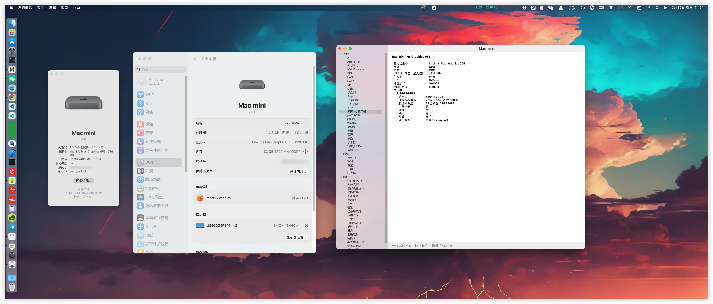

程序坞

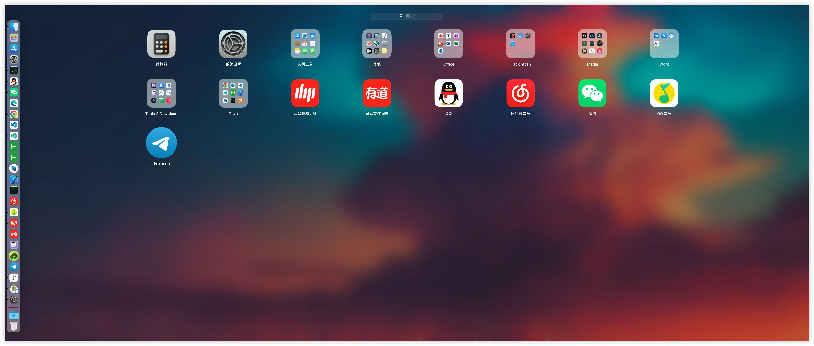

| Describe | screenshot                                                   |
| -------- | ------------------------------------------------------------ |
| Nvme     | 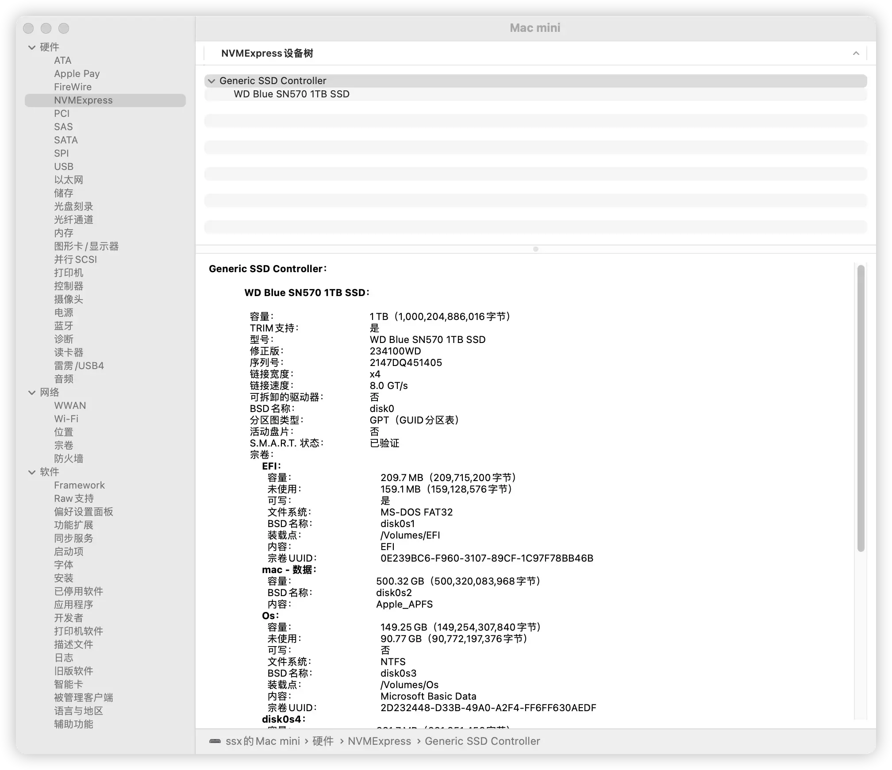 |
| USB      | 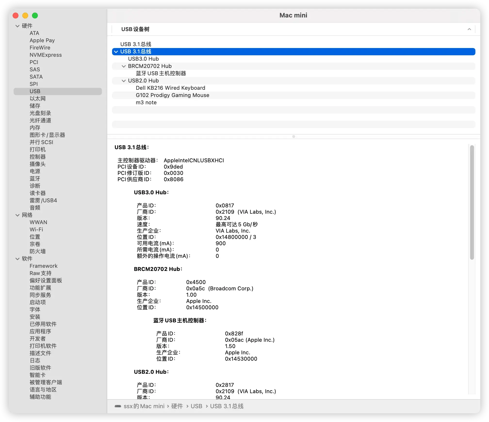 |
| 以太网   | 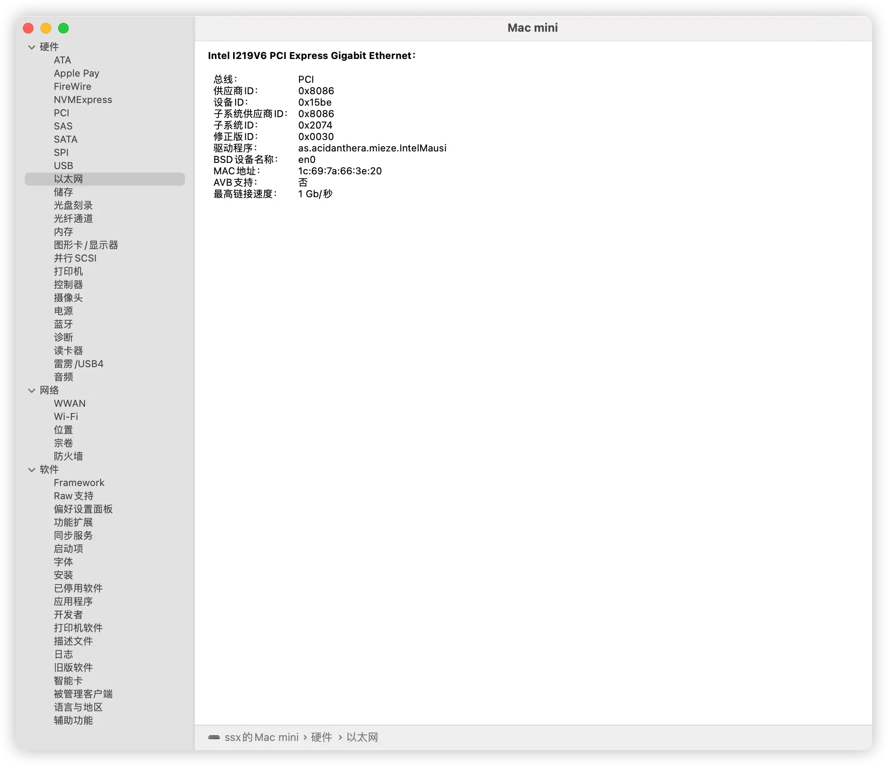 |
| 内存     | 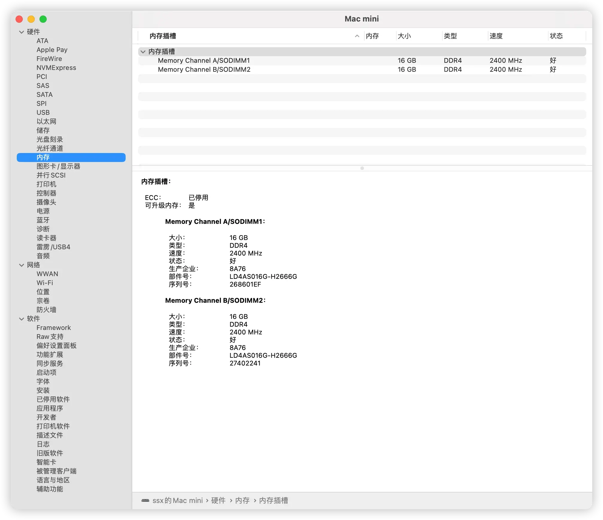 |
| 显卡     | 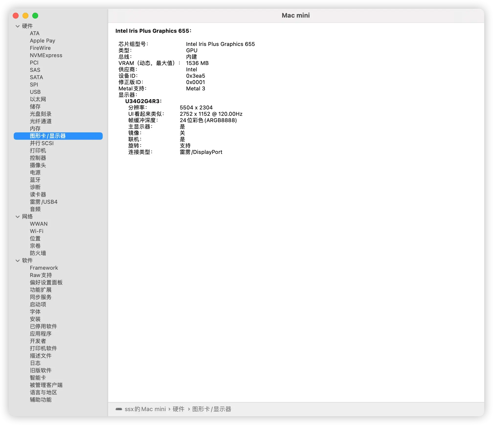 |
| 电源     | 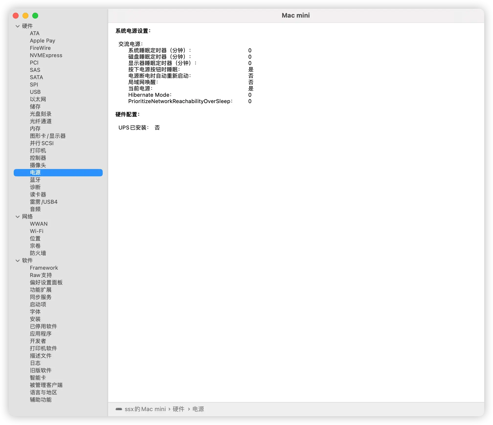 |
| 蓝牙     | 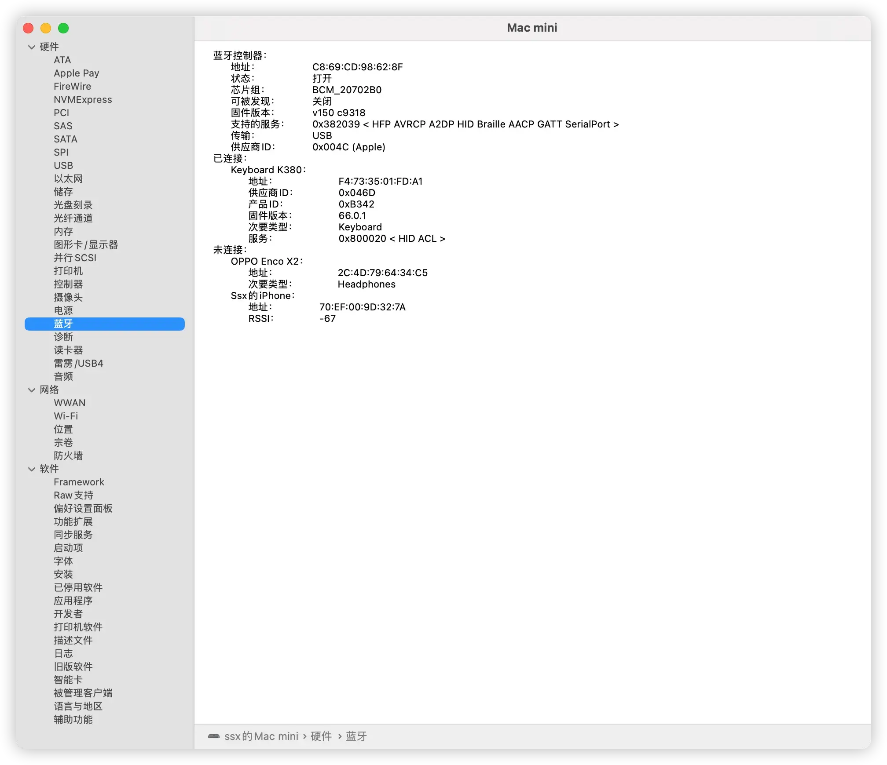 |
| 音频     | 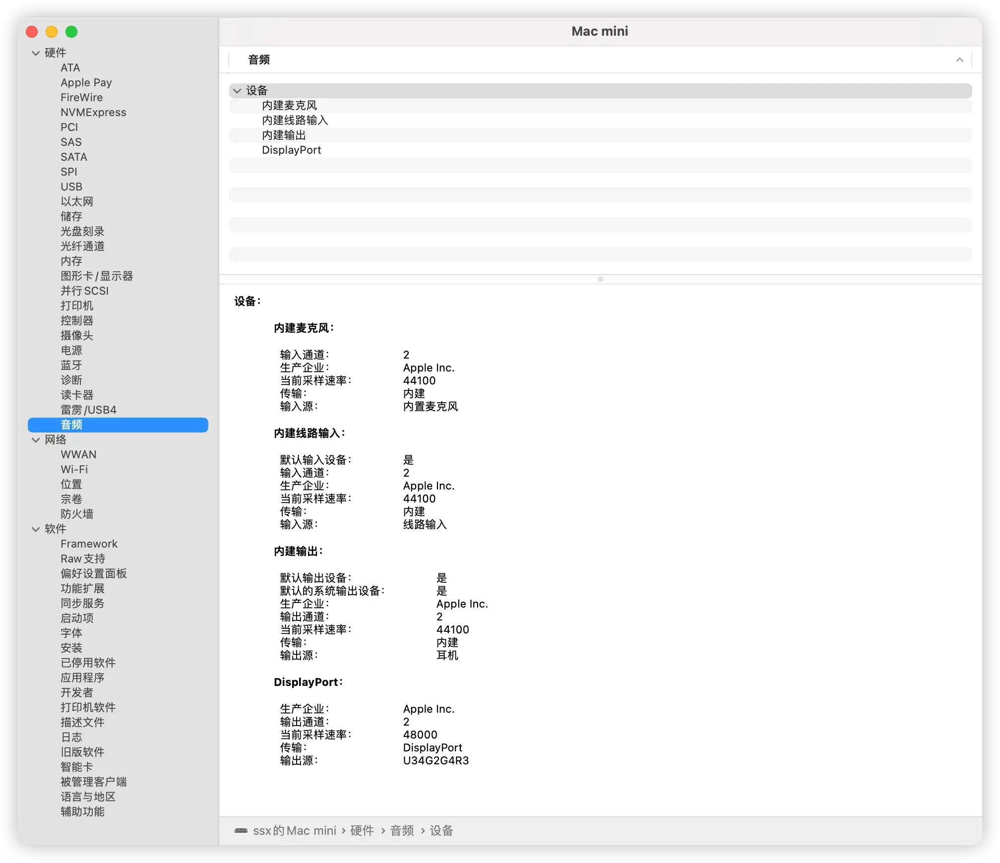 |
| WIFI     | 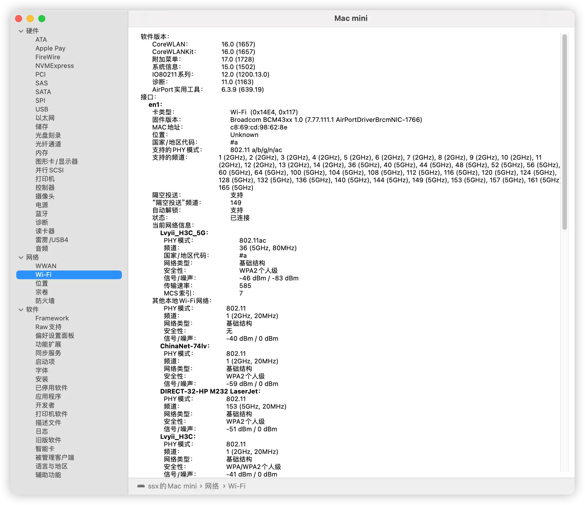 |

## 部分 efi 截图

| Describe | screenshot                                                   |
| :------: | ------------------------------------------------------------ |
|   ACPI   | 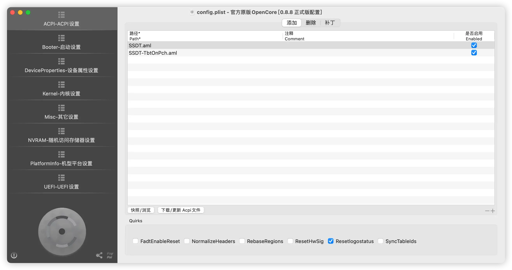 |
|    Dp    | 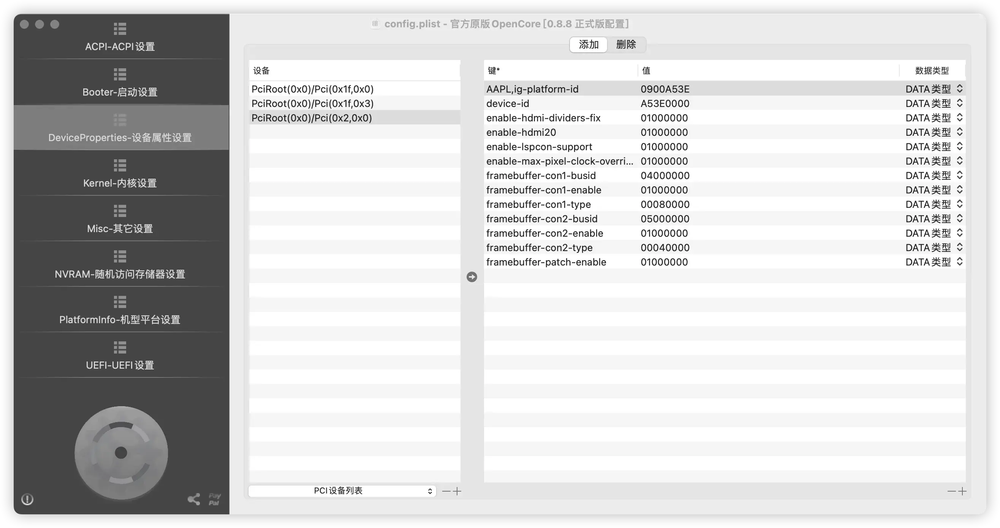 |
|  Kernel  | 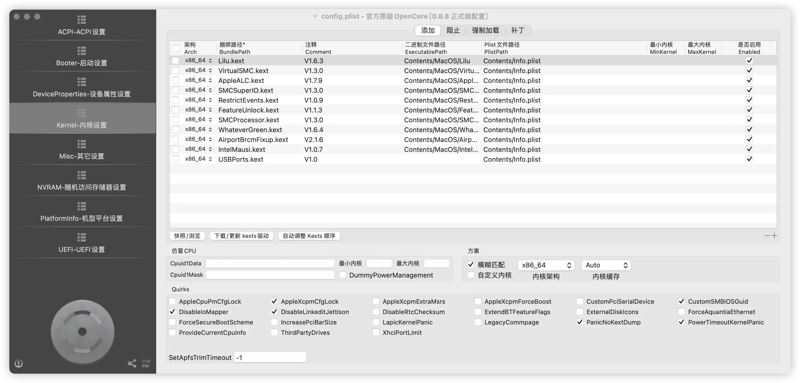 |

## 参考

- [[OpenCore] NUC8最新OC EFI 持续更新（已更新至0.8.7+13.1）](https://bbs.pcbeta.com/viewthread-1935097-1-1.html) by yippeeghost
